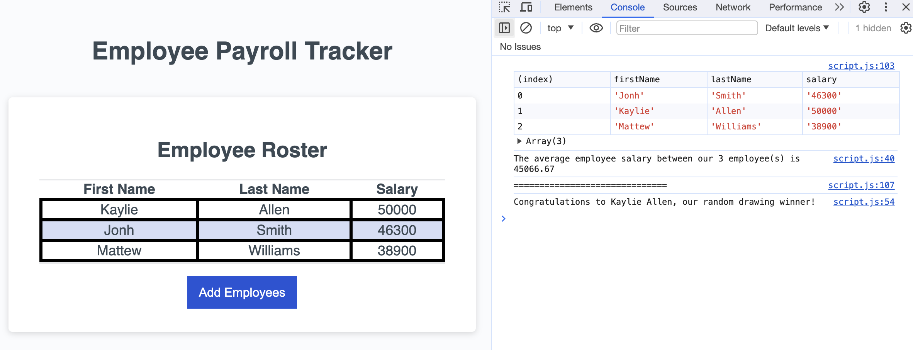

# employee-payroll-tracker
This web-site is Employee Payroll Tracker

## Description
The starter code have been received. It contains HTML, CSS and JavaScript.
This web-site was modified to create an application that enables to view and manage employee payroll data.

## Installation
N/A

## Usage
1. Open http: WEBSITE.
2. Click the "Add employee" button. Enter first name, last name and salary.
3. After adding an employee you will prompted to continue or cancel. If you choose to continue you can add another employee. If you choose to cancel you will see employee data is displayed on the page.

## Technologies Used
- HTML
- CSS
- JavaScript (was modified)

## Mock-Up
The following image shows the wed site appearance and functionality:
